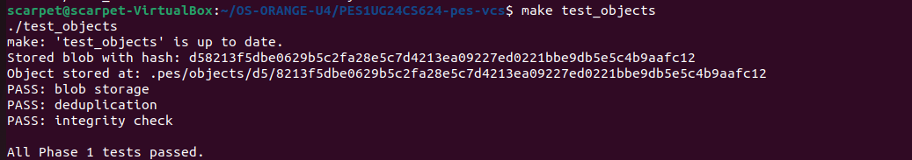
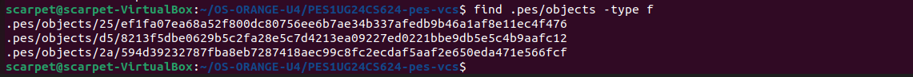
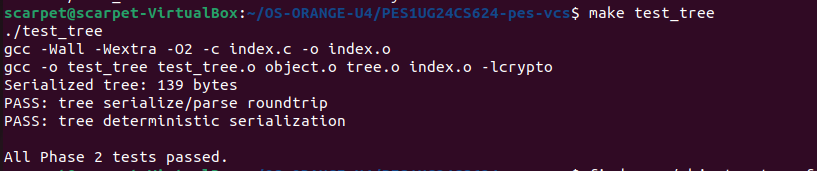
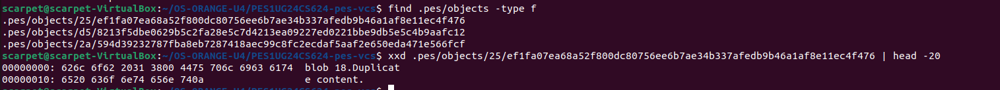
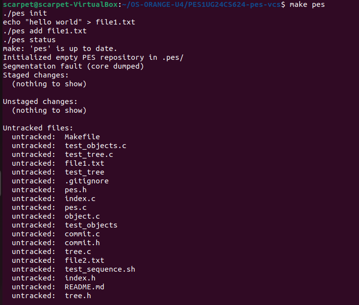
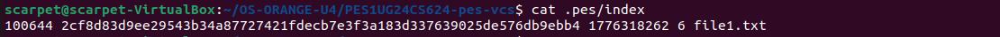
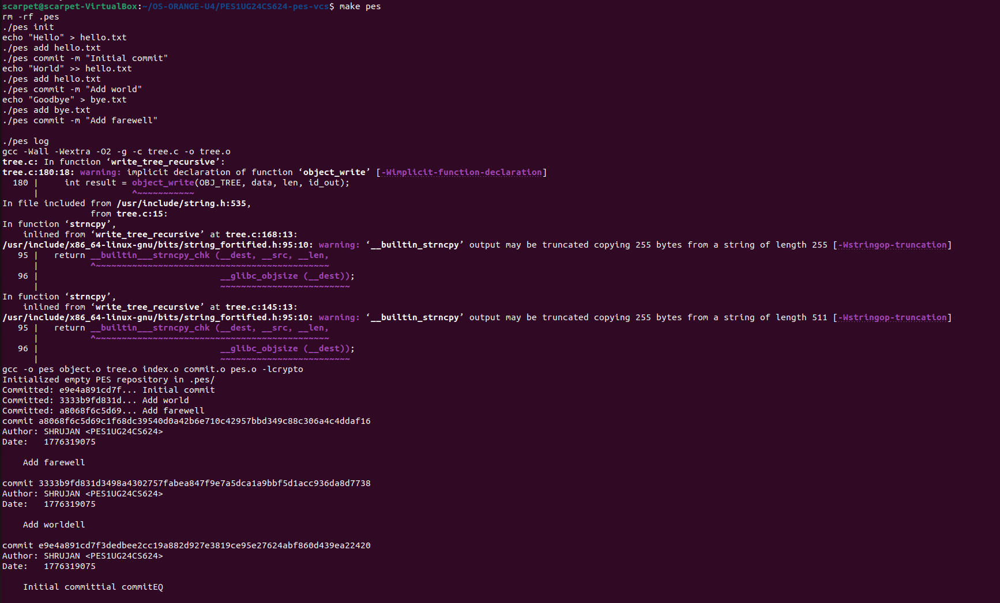
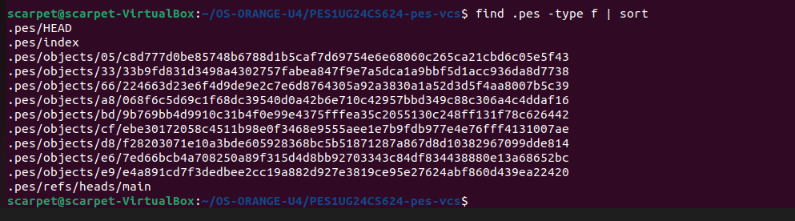
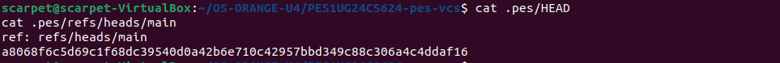
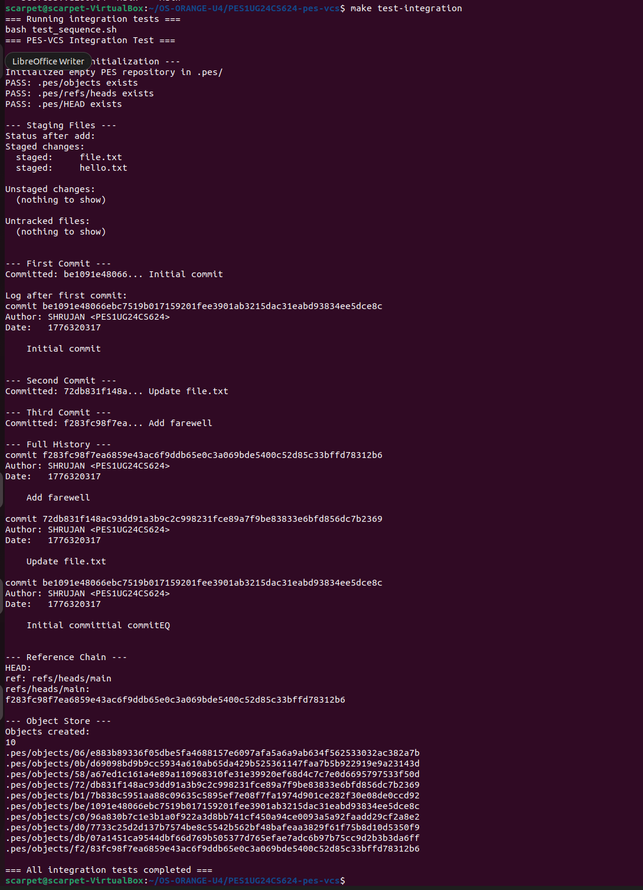

# Building PES-VCS — A Version Control System from Scratch

**NAME**: SHRUJAN N
**SRN**: PES1UG24CS624

---

## Phase 5 & 6: Analysis-Only Questions

### Branching and Checkout

**Q5.1: A branch in Git is just a file in `.git/refs/heads/` containing a commit hash. Creating a branch is creating a file. Given this, how would you implement `pes checkout <branch>` — what files need to change in `.pes/`, and what must happen to the working directory? What makes this operation complex?**

**Answer:** 
Implementing checkout is conceptually simple but practically annoying. 
1. Update `.pes/HEAD` to say `ref: refs/heads/<branch>`.
2. Read the commit hash from that branch file, grab its root tree, and recursively update the working directory and `.pes/index` to match that exact tree state.
The complex part isn't moving pointers; it's not nuking the user's unsaved work. You have to carefully diff the current working directory against the target tree and safely swap files without causing data loss.

**Q5.2: When switching branches, the working directory must be updated to match the target branch's tree. If the user has uncommitted changes to a tracked file, and that file differs between branches, checkout must refuse. Describe how you would detect this "dirty working directory" conflict using only the index and the object store.**

**Answer:** 
Easy. First, check the index. If a file's `mtime` or `size` on disk doesn't match what's recorded in the index, the file is "dirty" (uncommitted changes). 
Next, look at the target branch's tree in the object store. If the hash of that specific file in the target tree is different from the hash currently sitting in our index, we have a conflict. Refuse the checkout. If the target branch happens to have the exact same file hash, it's safe to leave the dirty file alone and proceed.

**Q5.3: "Detached HEAD" means HEAD contains a commit hash directly instead of a branch reference. What happens if you make commits in this state? How could a user recover those commits?**

**Answer:** 
If `.pes/HEAD` has a raw hash, you're detached. If you make a commit, HEAD updates to the new hash, but no branch pointer moves with it. The second you checkout another branch, those commits are left floating in the void (unreachable by any ref). 
To recover them, you just need the hash. You'd either scroll up in your terminal to find the hash you just made, or write a quick script to scan `.pes/objects/` for commit objects that aren't in the history of any branch (which is basically what `git reflog` or `git fsck --lost-found` does under the hood).

### Garbage Collection and Space Reclamation

**Q6.1: Over time, the object store accumulates unreachable objects — blobs, trees, or commits that no branch points to (directly or transitively). Describe an algorithm to find and delete these objects. What data structure would you use to track "reachable" hashes efficiently? For a repository with 100,000 commits and 50 branches, estimate how many objects you'd need to visit.**

**Answer:** 
Classic Mark and Sweep.
1. **Mark:** Initialize a Hash Set. Start at every branch pointer in `.pes/refs/heads/`. Walk the commit DAG backwards. For every commit, add its hash, its tree's hash, and recursively add all sub-tree and blob hashes to the Set.
2. **Sweep:** Walk the `.pes/objects/` directory. If a file's hash isn't in the Set, nuke it.
*Estimate:* 100k commits * ~100 objects per commit (assuming a decent sized repo with shared blobs) = ~10 million objects to visit. A Hash Set handles this easily in RAM.

**Q6.2: Why is it dangerous to run garbage collection concurrently with a commit operation? Describe a race condition where GC could delete an object that a concurrent commit is about to reference. How does Git's real GC avoid this?**

**Answer:** 
 I run `pes add`. I hash a file and write the blob to `.pes/objects/`. Right then, a background GC job starts. The GC does its "Mark" phase. Since my new blob isn't attached to a commit yet, it doesn't get marked. The GC sweeps and deletes my blob. A millisecond later, I run `pes commit`. The commit points to a tree, which points to a blob that GC just vaporized. The repo is now corrupt.
Git avoids this by being lazy: it uses a grace period. It simply ignores recent objects. It only deletes unreachable objects that have an `mtime` older than a certain threshold (usually 2 weeks).

---

## Submission Checklist

### Screenshots Required

*(Note: Images are located in the `screenshots/` directory)*

| Phase | ID  | What to Capture | Image |
| ----- | --- | --------------- | ----- |
| 1     | 1A  | `./test_objects` output showing all tests passing |  |
| 1     | 1B  | `find .pes/objects -type f` showing sharded directory structure |  |
| 2     | 2A  | `./test_tree` output showing all tests passing |  |
| 2     | 2B  | `xxd` of a raw tree object (first 20 lines) |  |
| 3     | 3A  | `pes init` → `pes add` → `pes status` sequence |  |
| 3     | 3B  | `cat .pes/index` showing the text-format index |  |
| 4     | 4A  | `pes log` output with three commits |  |
| 4     | 4B  | `find .pes -type f \| sort` showing object growth |  |
| 4     | 4C  | `cat .pes/refs/heads/main` and `cat .pes/HEAD` |  |
| Final | --  | Full integration test (`make test-integration`) |  |

